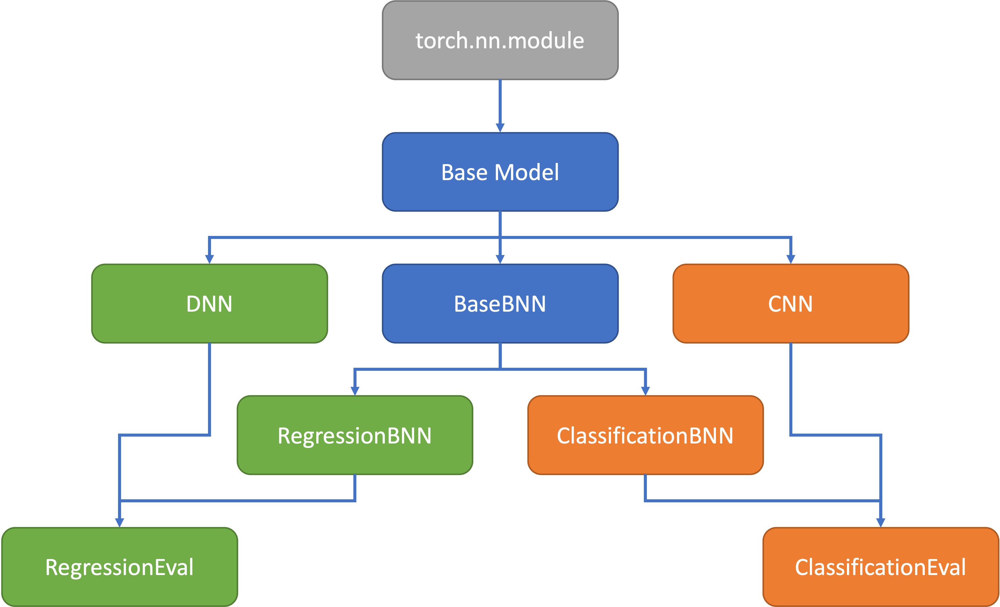

# BBB

## Environment Setup/Installation

Create a fresh Python 3.9 environment using venv, pyenv or conda (as preferred). Then, execute `setup.sh` to install the required python libraries and versions.

For mac users, the following would be appropriate.

```sh
brew install python@3.9
python3.9 -m venv .venv
source .venv/bin/activate
./setup.sh
```

### M1 Torch Issue

If running on M1 you will need to ensure the following library versions are being used. These should already be set in `requirements.txt`.

```sh
pip install --upgrade torch==1.9.0
pip install --upgrade torchvision==0.10.0

brew install hdf5
pip3 install --no-binary=h5py h5py
export HDF5_DIR=/opt/homebrew/opt/hdf5

python3 -m pip install tensorflow-macos==2.8.0
python3 -m pip install tensorflow-metal

```

## Execution

Once installed `bbb` can be run from the command line:

```sh
bbb [MODEL TYPE] [-d]
```

where the `-d` command is used to indicate whether to run the model deterministically (i.e., non-Bayesian approaches.).

For example, to run classification using BBB use the command:

```sh
bbb class
```

Whereas, classification can be run deterministically using:

```sh
bbb class -d
```

## Class Inheritance

The following diagram outlines the class inheritance structure of the implemented models.
<br/>
<br/>



<br/>
<br/>

## Citations

The following repositories were used as sources and for inspiration when implementing this project, and when debugging:

- [Bayesian Neural Networks (1)](https://github.com/JavierAntoran/Bayesian-Neural-Networks)
- [Bayesian Neural Networks (2)](https://github.com/tennisonliu/bayesian-neural-network)
- [Weight Uncertainty](https://github.com/danielkelshaw/WeightUncertainty)
- [PyTorch Bayesian CNN](https://github.com/kumar-shridhar/PyTorch-BayesianCNN)
- [Weight Uncertainty in Neural Networks](https://github.com/saxena-mayur/Weight-Uncertainty-in-Neural-Networks)
